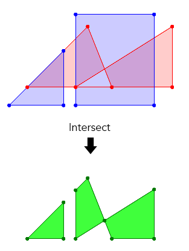

# rbxts-polybool

> [!NOTE]
> This is a port of the https://github.com/velipso/polybool specifically for the [`roblox-ts`](https://roblox-ts.com/) environment

This means it is available both as a package for those using roblox-ts or as a lua library.

## Installing

If you are using roblox-ts:
- `npm install @rbxts/polybool`
- `yarn install @rbxts/polybool`
- `pnpm install @rbxts/polybool`

If you are using a lua package manager:
- `wally install codyduong/polybool`

If you want the raw files (if you are using lua you only need lua files):
- See latest release: https://github.com/codyduong/rbxts-polybool/releases/latest
- Or simply look in /out/

## Example and Usage



The below examples will recreate this polygon

<ol>
  <li><a href="#using-polybool-in-roblox-ts">Using polybool in roblox-ts</a></li>
  <li><a href="#using-polybool-in-lualuau">Using polybool in lua/luau</a></li>
</ol>

### Using polybool in roblox-ts

More documentation is available at the original repository: https://github.com/velipso/polybool

It'll look pretty similiar and can be used the exact same as any example shown if you are using `roblox-ts`.

> [!IMPORTANT]
> Please read: [Vec2 vs Vector2](#vec2-vs-vector2) before proceeding

Using the Simplified Polygonal API:

```typescript
import polybool from '@velipso/polybool';

console.log(polybool.intersect(
  {
    regions: [
      [[50,50], [150,150], [190,50]],
      [[130,50], [290,150], [290,50]]
    ],
    inverted: false
  },
  {
    regions: [
      [[110,20], [110,110], [20,20]],
      [[130,170], [130,20], [260,20], [260,170]]
    ],
    inverted: false
  }
));

// output:
// {
//   regions: [
//     [[50,50], [110,50], [110,110]],
//     [[178,80], [130,50], [130,130], [150,150]],
//     [[178,80], [190,50], [260,50], [260,131.25]]
//   ],
//   inverted: false
// }
```

Using the Polygonal API:

```typescript
import polybool from '@velipso/polybool';

const poly1 = {
  regions: [
    [[50,50], [150,150], [190,50]],
    [[130,50], [290,150], [290,50]]
  ],
  inverted: false
};

const poly2 = {
  regions: [
    [[110,20], [110,110], [20,20]],
    [[130,170], [130,20], [260,20], [260,170]]
  ],
  inverted: false
};

const segs1 = polybool.segments(poly1);
const segs2 = polybool.segments(poly2);
const combined = polybool.combine(segs1, segs2);
const segs3 = polybool.selectIntersect(combined);
const result = polybool.polygon(segs3);

console.log(result);

// output:
// {
//   regions: [
//     [[50,50], [110,50], [110,110]],
//     [[178,80], [130,50], [130,130], [150,150]],
//     [[178,80], [190,50], [260,50], [260,131.25]]
//   ],
//   inverted: false
// }
```

Using the Instructional API:

```typescript
import polybool from '@velipso/polybool';

const shape1 = polybool.shape()
  .beginPath()
  .moveTo(50, 50)
  .lineTo(150, 150)
  .lineTo(190, 50)
  .closePath()
  .moveTo(130, 50)
  .lineTo(290, 150)
  .lineTo(290, 50)
  .closePath();

const shape2 = polybool.shape()
  .beginPath()
  .moveTo(110, 20)
  .lineTo(110, 110)
  .lineTo(20, 20)
  .closePath()
  .moveTo(130, 170)
  .lineTo(130, 20)
  .lineTo(260, 20)
  .lineTo(260, 170)
  .closePath();

const receiver = {
  beginPath: () => { console.log('beginPath'); },
  moveTo: (x: number, y: number) => { console.log('moveTo', x, y); },
  lineTo: (x: number, y: number) => { console.log('lineTo', x, y); },
  bezierCurveTo: (
    cp1x: number,
    cp1y: number,
    cp2x: number,
    cp2y: number,
    x: number,
    y: number,
  ) => { console.log('bezierCurveTo', cp1x, cp1y, cp2x, cp2y, x, y); },
  closePath: () => { console.log('closePath'); }
}

// start with the first shape
shape1
  // combine it with the second shape
  .combine(shape2)
  // perform the operation
  .intersect()
  // output results to the receiver object
  .output(receiver);

// output:
//   beginPath
//   moveTo 110 110
//   lineTo 50 50
//   lineTo 110 50
//   lineTo 110 110
//   closePath
//   moveTo 150 150
//   lineTo 178 80
//   lineTo 130 50
//   lineTo 130 130
//   lineTo 150 150
//   closePath
//   moveTo 260 131.25
//   lineTo 178 80
//   lineTo 190 50
//   lineTo 260 50
//   lineTo 260 131.25
//   closePath
```

### Using polybool in lua/luau

> **TODO**
>
> Feel free to make a pull request showcasing this code similarly as the typescript section

## `Vec2` vs `Vector2`

The primary concern is that the intermediary data format used by polybool for `Vec2` is `[x: number, y: number]`.
However, if you are familiar with Roblox you'll know that there is a 
[`Vector2`](https://create.roblox.com/docs/reference/engine/datatypes/Vector2) datatype.

For sake of compatibility with the original library, we do not modify this intermediate format.

To this end we have provided a utility API to convert between the two

#### In typescript:
```ts
import polybool, { intoVec2, intoVector2, Vec2 } from "@rbxts/polybool";
// or if it is confusing, you can rename them
// import polybool, { intoVec2 as intoPolyboolVector2, intoRobloxVector2, Vec2 } from "@rbxts/polybool";

const vec2: Vec2 = [0.5, 0.5];
const vector2 = intoVector2(vec2); // Vector2 datatype from roblox
const vec2again = intoVec2(vector2); // back into [0.5, 0.5]

```
```ts
const robloxVectors: Vector2[] = [
  new Vector2(0, 0),
  new Vector2(0.5, 0),
  new Vector2(0, 0.5),
] // right triangle
const readyForPolybool = myVectorsFromSomewhere.map(intoVec2)
```

```ts
// ...
const result = polybool.polygon(segs3);

console.log(result);
// output:
// {
//   regions: [
//     [[50,50], [110,50], [110,110]],
//     [[178,80], [130,50], [130,130], [150,150]],
//     [[178,80], [190,50], [260,50], [260,131.25]]
//   ],
//   inverted: false
// }

const robloxRegions = {
  regions: result.regions.map((region) => region.map(intoVector2)),
  inverted: result.inverted,
}
```

#### In lua/luau:

> **TODO**
>
> Feel free to make a pull request showcasing this code similarly as the typescript section

